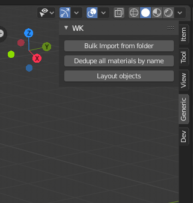
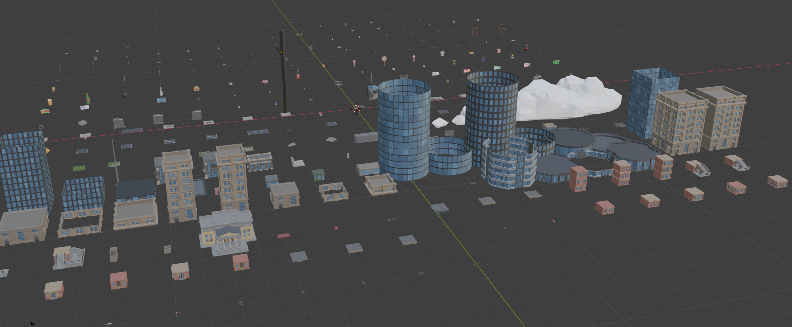

# blender-unity-fbx-import
blender plugin to help import unity-formatted fbx asset packs. As such, you can buy and download asset packs you like from the unity asset store, then import them back to blender for some tweaking and tuning. I try my best to presere the original materials and texture bindings, so that you don't have to re-link everything.

This is my first blender plug-in. It's got a bunch of hard-coded values and paths. Contributions welcome!

# Instalaltion
easiest way is to git-clone this repo into ~/Library/Application Support/Blender/2.80/scripts/addons/blender-unity-fbx-import

Then it shows up here when you press "N"


# bluk import script
Not everything is automated, here are some tips that may help

I've found most FBX from asset stores have links to the original ".psd" file in them, instead of the ".png" that you'll really have in your asset folder. This will confuse blender's built-in FBX importer. Run this bash script (tested on mac) in the "Models" folder to switch the extension. (Please backup your files! this is a brude-force trick that can backfire!)

``` bash
LANG=C LC_CTYPE=C find . -name "*.fbx" -exec sed -i.bu 's/\.psd/\.png/g' {} \;
```

The script will import from a hard-coded location on my machine. you should adjust that first.

# layout operation

Lays out all objects on a XY grid. Edit the "stride" variable to adjust spacing. 


# dedupe materials

Since you're importing over and over again a bunch of time, you'll have many copies of the same material, images etc...
Running this script will cleanup some (but not all) of that. I'd like to do more, but this is enough for me at the moment